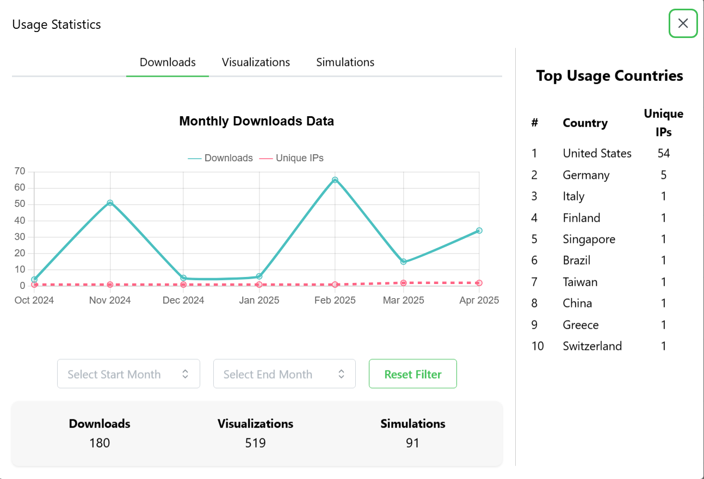
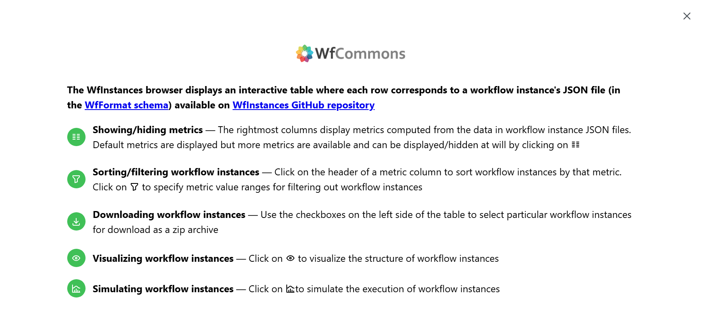
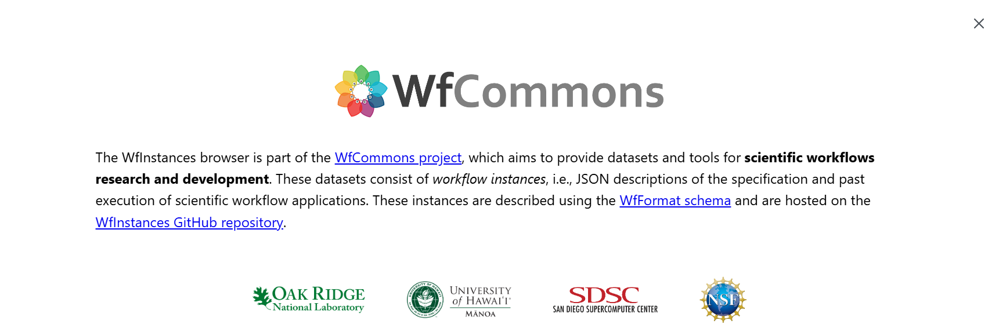
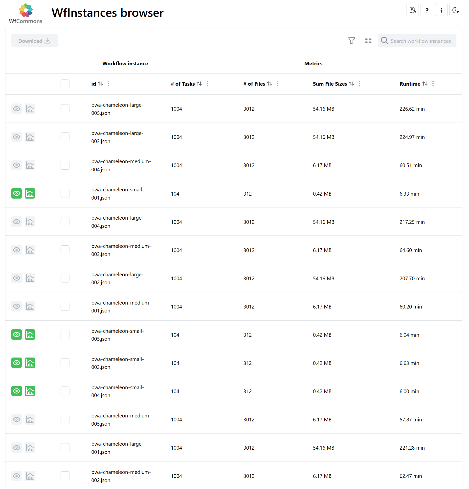
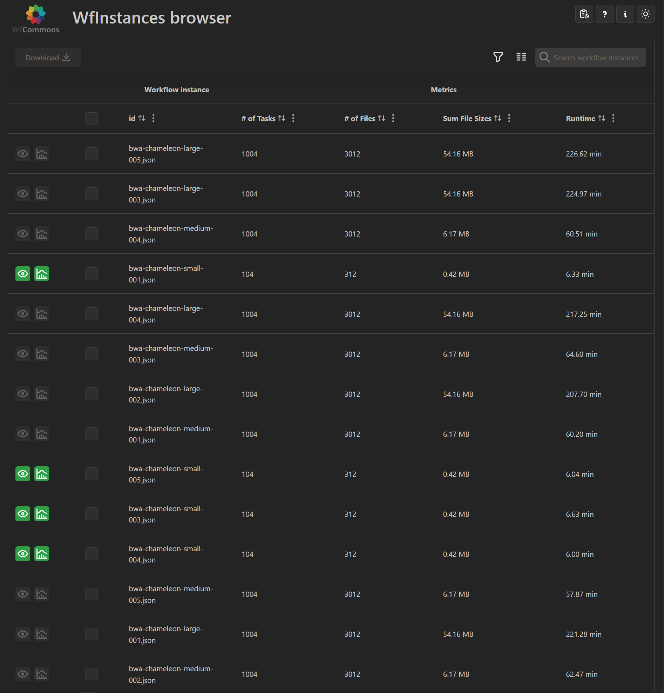

## Table of Contents

* [Overview](#overview)
* [User Guide](#user-guide)
* [Developer Guide](#developer-guide)
* [Issues Development History](#issues-development-history)
* [Weekly Progression](#weekly-progression)
* [Team](#team)
* [Organization](#organization)

## Overview

The WfInstances Browser is a web application that allows users to browse, select, and visualize the available [workflow instances](https://github.com/wfcommons/WfInstances) provided by the [WfCommons Project](https://wfcommons.org). It is currently live in deployment at [https://wfinstances.ics.hawaii.edu/](https://wfinstances.ics.hawaii.edu/).

## User Guide

In the WfInstances Browser, users are able to download, visualize, and simulate workflow instances. Additional modals are located on the navbar for usage report, app help, an about section, and the option to toggle between light and dark mode. 

<figure style="text-align:left;">
  <figcaption style="color:black;"><em>Figure 1. Usage Modal</em></figcaption>
  
</figure>


<figure style="text-align:left;">
  <figcaption style="color:black;"><em>Figure 2. Help… Modal</em></figcaption>
  
</figure>


<figure style="text-align:left;">
  <figcaption style="color:black;"><em>Figure 3. About… Modal</em></figcaption>
  
</figure>


<figure style="text-align:left;">
  <figcaption style="color:black;"><em>Figure 4. Light Mode</em></figcaption>
  
</figure>


<figure style="text-align:left;">
  <figcaption style="color:black;"><em>Figure 5. Dark Mode</em></figcaption>
  
</figure>


## Developer Guide

To run the server for production, you will need [Docker Desktop](https://www.docker.com/).

Running with Docker; 

Dependencies:
- [Docker](https://docs.docker.com/install/)
- [Docker Compose](https://docs.docker.com/compose/install/)

Edit/use one of the `.env-*` files to configure the deployment, and then:

```bash
$ docker-compose --env-file <.env file> build  --no-cache
$ docker-compose up [-d]
```

The above will not run any Nginx front-end. If you want to do so, you must add the `--profile with-my-own-nginx` argument to the `docker-compose` commands above.

The database is empty the first time you launch the browser. To populate the database with metrics from the official [WfCommons WfInstances GitHub repo](https://github.com/wfcommons/WfInstances), run this command in a terminal on the machine running the server:
```
curl -X PUT http://localhost:8081/metrics/private/github/wfcommons/WfInstances
```

REST API documentation is available at: [http://localhost:8081/docs](http://localhost:8081/docs)

(The above assumes WFINSTANCES_API_PORT=8081 is the configured port for the backend, as condigured in the `.env-*` file in use.)

## Issues Development History 
---
### issue-001: Usage Stats Modal
- Created the modal for usage report and added it to the navbar
- Imported button icon from React Bootstrap
- Opens a modal which will store app usage information
  
### issue-002: UI shows data from API fetch 
- Created new API endpoint to show total count each for downloads, visualizations and simlulations
- Usage report displays data fetched from url route: .../usage/public/totals
- Modal shows total number of downloads, visualizations and simulations
  
### issue-003: User Survey 
- Created a button that opens a questionnaire modal within the navbar
- Imported pencil icon for button from React Bootstrap
- Currently is not connected to a database
- Asks the user for to provide a name, email, and app feedback
  
### issue-004: API endpoint for weekly usage
- Created new endpoint to get weekly usage data grouped by their type (download, visualization, simulation)
- Also retrieves the number of unique IPs per week
  
### issue-005: Graph Visualization
- Implemented a graph feature using Chart.js to visualize the total count of what was used in the app 
- Fetches weekly data for downloads, visualizations, and simulations based on the selected type
- Buttons allow to toggle between the three different types of usage
  
### issue-006: IPInfo IP Geolocation Tracking
- Enabled IP geolocation to see which countries use the app the most
- Resolves user IP to a country name
  
### issue-007: Sidebar for the top usage countries
- Added a sidebar within the usage report modal that displays the countries that have used the app the most
- Uses IP geolocation from previous issue to resolve a user's IP to a country name if they used an app feature
- Displays top ten countries based on combined usage (downloads, visualization, simulation)
  
### issue-008: Timescale feature
- Implemented a timescale feature for the graph
- Users can zoom/pan out of the chart to see data from a particular time more in-depth
  
### issue-009: UI adjustments
- Updated the UI to make it look more cohesive and easier to navigate
- Data is fetched in parallel to make it faster
- Graph is made bigger (left side for the graph, right side for the top countries sidebar)
- Section for totals at the bottom of the modal's left column for combined count each for downloads, visualizations, and simulations
  
### issue-010: API endpoint for monthly usage
- Changed how data is retrieved from weekly to monthly usage
- Created new endpoint to get monthly usage data grouped by their type (download, visualization, simulation)
### issue-011: Random Survey Pop-up
- A random survey will pop-up when user has used download, visualization, and simulation on the 5th, 50th and 500th event
- Asks two questions to give the app a rating based on usability and usefulness
- “On a scale of 1 to 10 how would you rate the usefulness of this application?” when occasionally prompted
- “On a scale of 1 to 10 how would you rate the usability of this application?” when occasionally prompted
- Added a survey database to account for total user clicks, IP, and rating number
  
### issue-012: Updated the graph's legend
- Changed chart legend to use a line representation instead of a square
- Used rgba(75, 192, 192, 0.2) for download/visualization/simulation solid line
- Used rgba(255, 99, 132, 0.2) for unique IPs dotted line
- Updated pan feature so you can pan both left/right and up/down on the graph
  
### issue-013: Redesign of workflow instances retrieval
- Use git clone and git pull to update the workflow instances
- Cron job to git pull every hour instead of every 7 days
- Git cloning instance of repo for WfInstances functions as intended
- Clones repo if it does not exist locally
  
### issue-014: Filter the graph's date range
- Replaced the zoom/pan feature of the graph to have a filter date range instead
- Allows users to select MM/YY - MM/YY range to view the timescale only within that scope
  
### issue-015: Satisfaction database
- Implemented a satisfaction database to store the results of the user survey ratings
- Ratings range from 1 to 10
- The collection is used to keep track of score distribution for app features (simulations, visualizations, general usage)

## Weekly Progression
---
Below is a summarized outlook of our progress and the discussions in the sponsor meetings between our team and [Professor Henri Casanova](https://henricasanova.github.io/).

### Meeting 1 (Week: 1/21 - 1/27)
Date: Tuesday, 1/21/25

Business:
- Project was introduced 
- Went over scope of project
- Discussed issues and project deliverables 

Actions: 
- Created WfInstances organization for team
- Forked WfInstances-browser repo
- Ran the app and populated the database
- Added a usage report button that opens a popup with placeholder text
  
---
### Meeting 2 (Week: 1/28 - 2/3)
Date: Tuesday, 1/28/25

Business: 
- Talked about what usage report button should display to user
- Discussed ways to connect backend and frontend
- Went over how the API fetches data

Actions: 
- Created a new issue for making button display data to user
- Added a new totals endpoint to usage/router.py under api
- Modified UsageStatsModal.tsx to fetch data from the totals endpoint
- Went over how to show data better (graph, tabs for separate collections)
- Created button for user survey questionnaire
  
---
### Meeting 3 (Week: 2/4 - 2/10)
Date: Tuesday, 2/4/25 

Business: 
- Modified database to get accurate dump of usage stats
- Talked about ways to show location of where people are using the system (world map from IPs)
- Continued discussing potential ways to do the visualization of usage data

Actions:
- Created a new API endpoint for weekly usage data grouped by their type
- Implemented a linen chart graph for showing the frequency of what is used on the site
- Added buttons to switch between the three different usage types (downloads, visualizations, simulations)
  
---
### Meeting 4 (Week: 2/11 - 2/17)
Date: Tuesday, 2/11/25

Business:
- Discussed ways to add IP geolocation
- Went over setting up ipinfo_token to convert IP to a country name
- Sidebar should show countries that use what features of the site most

Actions:
- Implemented the feature for a sidebar to show top countries that use features the most
- Edited get_ip_country_name in service.py to take in IP and return country name
- Added get_top_countries function in service.py to return top 10 countries where features are used most
- Added new endpoints for showing all distinct IPs and their country names and for showing top countries based on combined usage
  
---
### Meeting 5 (Week: 2/18 - 2/24)
Date: Tuesday, 2/18/25

Business: 
- Short meeting to talk about next steps for project
- Went over plan to add timescale feature to zoom in on graph 

Actions:
- Changed the usage graph to show data by month 
- Added another line in graph for distinct IPs for a month
- Fetch all data in parallel to make it faster
  
---
### Meeting 6 (Week: 2/25 - 3/3)
Date: Tuesday, 2/25/25

Business: 
- Discussed a redesign to retrieve WfCommons workflow .json files through the git Python package
- Use git clone and git pull to update the workflow instances
- Cron job to git pull every hour instead of every 7 days

Actions: 
- Added timescale feature to zoom in on the usage graph
- Make graph legend use lines instead of square/rectangle for representation
- Change modal size and chart zoom/pan sensitivity
  
---
### Meeting 7 (Week: 3/4 - 3/10)
Date: Tuesday, 3/4/25

Business: 
- Talked about making the user survey an occasional pop-up instead of a modal on the navbar
- Discussed adding a survey database with a collection to keep track of clicks for visualizations, simulations and downloads
- A satisfaction update that triggers the pop-up survey will appear on the 5th, 50th and 500th event
- Discussed adding a satisfaction database to keep track of the distribution of scores from the user survey

Actions:
- Implemented the new approach for retrieving the WfCommons workflow instances
- Git cloning instance of repo for WfInstances functions as intended
- Clones repo if it does not exist locally
  
---
### Meeting 8 (Week: 3/11 - 3/17)
Date: Tuesday, 3/11/25

Business:
- No meeting next week on 3/18/25 (Spring Break)
- Discussed changing the zoom/pan feature of the graph to instead use a filter date range
- Discussed editing the survey to ask the user two questions about the usefulness and usability of the app

Actions: 
- Added a surveys collection to account for total user clicks that triggers the pop-up survey
- Survey currently asks the user to rate the app with a number from 1 to 10
- Implemented the filter date range feature for analyzing the graph's usage stats
  
---
### Meeting 9 (Week: 3/25 - 3/31)
Date: Tuesday, 3/25/25

Business: 
- Talked about editing the pop-up survey to remove the success alert when submitting the survey
- Discussed adding a feature to the README of the wfcommons/WfInstances repo that has the workflow instances
- Discussed developing a GitHub action to display WfInstances Browser usage data

Actions:
- Renamed main repo "wfinstances-browser" to ["wfinstances-browser-first-fork"](https://github.com/WfInstances/wfinstances-browser-first-fork) (development repo was not fork of original repo from wfcommons GitHub)
- Moved and copied the files, commits and project board over to the new [wfinstances-browser](https://github.com/WfInstances/wfinstances-browser) repo
- Implemented the satisfaction database to for keeping track of score distribution
- User survey now asks for two ratings for the app; one for usefulness and the other for usability
  
---
### Meeting 10 (Week: 4/1 - 4/7)
Date: Tuesday, 4/1/25

Business: 
- Talked more about creating a GitHub action for showing usage data of the WfInstances Browser on the wfcommons/WfInstances repo
- Discussed using shields.io to display badges for total number of downloads, visualizations, simulations, and users

Actions:
- Created a new [repo](https://github.com/WfInstances/WfInstances-gitHub-actions) for developing the GitHub action
- Completed a GitHub action that periodically updates the README of the wfcommons/WfInstances repo
- README uses shields.io badges to show usage report from WfInstances Browser
- Shows total number of users, visualizations, simulations, and downloads
  
---
### Meeting 11 (Week: 4/8 - 4/14)
Date: Tuesday, 4/8/25

Business: 
- Discussed the conclusion of the project
- Talked about beginning to work a draft for the poster

Actions:
- Started to work on creating a draft version of the poster
  
---
### Meeting 12 (Week: 4/15 - 4/21)
Date: Tuesday, 4/15/22

Business: 
- Final meeting to discuss progress on poster draft
- Discussed how to best orient the components of the poster

Actions: 
- Modified the layout of the included sections
- Completed polishments for final version of the poster

## Team 

1. [Jianlong Chen](https://jianlongchenn.github.io/)
2. [Kenneth de Guzman](https://k-deguz.github.io/)

## Organization

> Github Organization: [View!](https://github.com/orgs/WfInstances/repositories)
